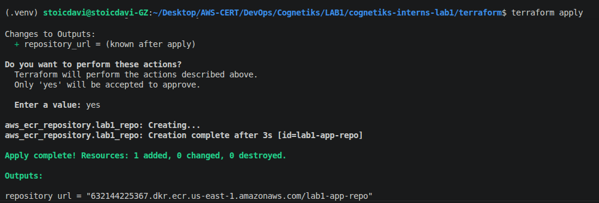
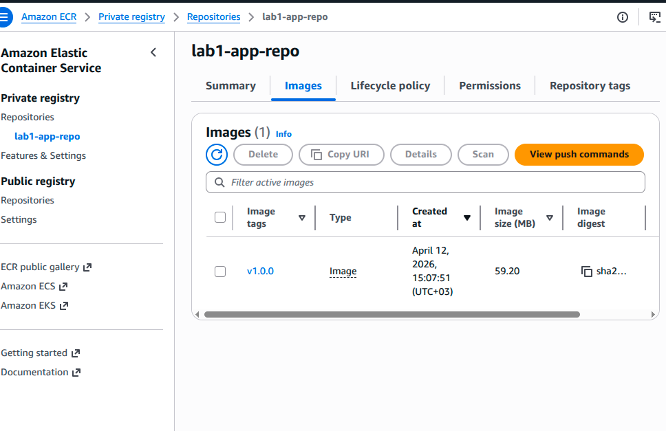
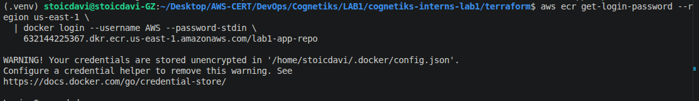
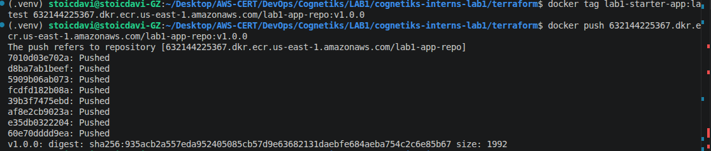
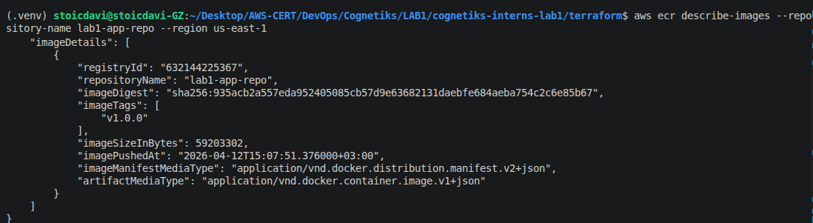
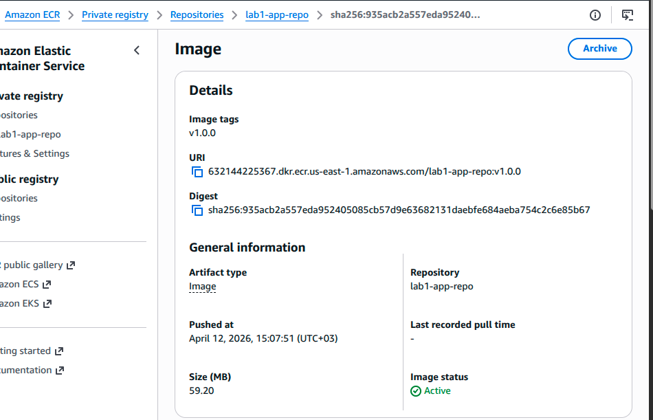

# Step 3 — Create and Use Amazon ECR

## Overview

In this step you will:
- Create an Amazon ECR repository using Terraform
- Authenticate Docker to ECR
- Build, tag, and push your Docker image
- Validate the image is visible in ECR with the correct tag

---

## Prerequisites

Before starting, make sure you have:
- AWS CLI installed and configured (`aws configure`)
- Docker installed and running
- Terraform installed
- Your Docker image built from Step 2

To confirm your AWS identity:

```bash
aws sts get-caller-identity
```


---

## 3.1 — Create the ECR Repository with Terraform

Navigate to the `terraform/` directory:

```bash
cd terraform
```

Your `main.tf` defines the ECR repository:

```hcl
terraform {
  required_providers {
    aws = {
      source  = "hashicorp/aws"
      version = "~> 5.0"
    }
  }
}

provider "aws" {
  region = "us-east-1"
}

resource "aws_ecr_repository" "lab1_repo" {
  name                 = "lab1-app-repo"
  image_tag_mutability = "MUTABLE"

  tags = {
    environment = "dev"
  }
}

output "repository_url" {
  value = aws_ecr_repository.lab1_repo.repository_url
}

```

Initialize and apply:

```bash
terraform init
terraform apply
```

When prompted, type `yes` to confirm.

After apply completes, Terraform will output the repository URL:

```
repository_url = "123456789012.dkr.ecr.us-east-1.amazonaws.com/lab1-app-repo"
```

Copy this URL — you will need it in the next steps.


---

## 3.2 — Verify the Repository in the AWS Console

1. Open the [AWS Console](https://console.aws.amazon.com)
2. Navigate to **ECR → Repositories**
3. Confirm `lab1-app-repo` is listed


---

## 3.3 — Authenticate Docker to ECR

Run the login command below, replacing `123456789012` with your actual AWS account ID:

```bash
aws ecr get-login-password --region us-east-1 \
  | docker login --username AWS --password-stdin \
    123456789012.dkr.ecr.us-east-1.amazonaws.com
```

You should see:

```
Login Succeeded
```


---

## 3.4 — Build, Tag, and Push the Image

### Build the image

From the project root (where your `Dockerfile` is):

```bash
docker build -t lab1-app-repo .
```

### Tag the image with the ECR URL and version

```bash
docker tag lab1-app-repo:latest \
  123456789012.dkr.ecr.us-east-1.amazonaws.com/lab1-app-repo:v1.0.0
```

### Push the image to ECR

```bash
docker push 123456789012.dkr.ecr.us-east-1.amazonaws.com/lab1-app-repo:v1.0.0
```


---

## 3.5 — Validate

### Via AWS CLI

```bash
aws ecr describe-images \
  --repository-name lab1-app-repo \
  --region us-east-1
```

You should see your image listed with `imageTag: v1.0.0`.

### Via AWS Console

1. Navigate to **ECR → Repositories → lab1-app-repo → Images**
2. Confirm the image is listed with:
   - Tag: `v1.0.0`
   - A valid image digest
   - A recent push date




---

## Summary

| Task | Status |
|---|---|
| ECR repository created via Terraform | ✅ |
| Docker authenticated to ECR | ✅ |
| Image built and tagged `v1.0.0` | ✅ |
| Image pushed to ECR | ✅ |
| Image visible in AWS Console | ✅ |
